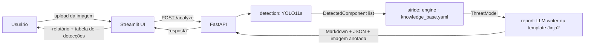

# 🛡️ Modelagem de Ameaças STRIDE por IA — Hackathon FIAP Fase 5

Este projeto (`strideai`) recebe uma **imagem de diagrama de arquitetura de
software** (por exemplo, uma arquitetura de referência AWS ou Azure) e devolve
automaticamente um **relatório de modelagem de ameaças STRIDE**. Um detector
YOLO, treinado por nós num dataset próprio (sintético + real, anotado),
identifica os componentes desenhados no diagrama (usuários, gateways, bancos
de dados, filas, WAFs, etc.); uma base de conhecimento STRIDE, escrita à mão,
mapeia cada tipo de componente às ameaças e contramedidas aplicáveis; e um
LLM (Claude) organiza esses dados estruturados em um relatório corrido, em
português, com um gerador de template determinístico como *fallback* — o
sistema sempre produz um relatório, mesmo sem chave de API configurada.

## Arquitetura da solução



- **`app/streamlit_app.py`** — front-end de página única: upload da imagem,
  slider de confiança, exemplos prontos (as duas figuras de avaliação do
  desafio), imagem anotada lado a lado com a original, tabela de detecções,
  relatório renderizado e botão de download em `.md`.
- **`src/strideai/api`** — serviço FastAPI com `POST /analyze` (multipart) e
  `GET /health`, documentação Swagger automática em `/docs`.
- **`src/strideai/detection`** — encapsula o modelo YOLO treinado
  (`ComponentDetector`) e desenha as caixas delimitadoras na imagem de saída.
- **`src/strideai/stride`** — `knowledge_base.yaml` (uma entrada por classe
  canônica, com ameaças STRIDE, severidade e contramedidas) e o motor
  determinístico `engine.py` que deduplica componentes repetidos e aplica
  regras de composição (ex.: banco de dados sem WAF gera um aviso).
- **`src/strideai/report`** — `llm_writer.py` (Claude, restrito a reformular
  o JSON estruturado, sem inventar ameaças) e `template_writer.py` (Jinja2,
  sempre disponível como *fallback*).
- **`src/strideai/core/models.py`** — contratos Pydantic compartilhados por
  todos os módulos (`DetectedComponent`, `Threat`, `ThreatModel`,
  `AnalysisResponse`), incluindo a lista canônica das 15 classes de
  componente (o índice da lista é o índice de classe do YOLO).

## Como executar

### Com Docker (recomendado para avaliação)

```powershell
python scripts/download_weights.py --url <url-da-release-com-o-best.pt>
docker compose up --build
# UI:            http://localhost:8501
# API/Swagger:   http://localhost:8000/docs
# Para relatórios via LLM: exporte ANTHROPIC_API_KEY antes do compose up (opcional)
```

O `docker compose up` sobe dois serviços (`docker-compose.yml`): `api`
(`docker/Dockerfile.api`, porta 8000) e `app` (`docker/Dockerfile.app`, porta
8501, que fala com a API via `API_URL=http://api:8000`). Os pesos treinados
não são versionados no Git (`models/*.pt` está no `.gitignore`); baixe-os de
uma *release* do GitHub com `scripts/download_weights.py` antes de subir o
compose — sem eles, a API sobe normalmente mas `/analyze` responde `503`
(`detector not loaded`) até que `models/best.pt` exista. A variável
`ANTHROPIC_API_KEY` é opcional: sem ela, os relatórios saem pelo caminho de
template determinístico em vez do LLM.

### Local (desenvolvimento)

```powershell
pip install -e .[dev]
python -m pytest
uvicorn strideai.api.main:app --port 8000
streamlit run app/streamlit_app.py
```

Em outro terminal, com a API no ar, rode o Streamlit (ele usa
`API_URL=http://localhost:8000` por padrão). Sem `models/best.pt` local, a
API funciona mas sem detector carregado — suficiente para rodar a suíte de
testes unitários, que não depende de pesos treinados.

Para rodar também os testes de integração (smoke test completo nas duas
figuras de avaliação do desafio, que exigem pesos treinados):

```powershell
python scripts/download_weights.py --url <url-da-release>
python scripts/extract_eval_figures.py
python -m pytest -m integration -v
```

## Dataset e treinamento

O dataset segue uma taxonomia canônica de 15 classes de componente (`user`,
`web_client`, `api_gateway`, `load_balancer`, `app_server`, `database`,
`cache`, `queue`, `storage`, `function_serverless`, `firewall_waf`,
`auth_service`, `cdn`, `monitoring`, `external_service`), construído a partir
de três fontes: (1) geração sintética em massa compondo ícones oficiais
AWS/Azure/GCP sobre um canvas com PIL — como o próprio script escolhe a
posição dos ícones, as anotações YOLO (bounding boxes) saem exatas e sem
custo humano (ver `dataset/generate_synthetic.py` e `dataset/icons/README.md`
para a biblioteca de ícones esperada); (2) datasets públicos do Roboflow
Universe remapeados para a taxonomia; e (3) diagramas reais de arquiteturas
de referência, anotados manualmente pela equipe no Roboflow. O script
`dataset/build_dataset.py` funde essas fontes no dataset final em formato
YOLO, com a política de que dados sintéticos vão para o treino e dados reais
anotados à mão são divididos entre validação e teste — assim as métricas
reportadas refletem o desempenho em diagramas no estilo dos avaliadores, não
em imagens sintéticas.

O modelo é um YOLO11s ajustado a partir dos pesos pré-treinados em COCO
(`training/train.py`, com instruções de execução local e no Google Colab em
`training/README.md`). Os resultados de cada execução (métricas mAP50 geral e
por classe, contagens de dataset, hiperparâmetros) são registrados em
`training/RESULTS.md` — no momento deste commit, o treinamento ainda não foi
executado pela equipe, então esse arquivo é um template vazio a ser
preenchido após o primeiro treino real; veja também `docs/development-flow.md`
para os detalhes de hiperparâmetros e critério de aceite.

## Estrutura do repositório

| Pasta | Responsabilidade |
|---|---|
| `src/strideai/core` | Contratos Pydantic compartilhados (componentes, ameaças, modelo de ameaças) |
| `src/strideai/detection` | Wrapper do YOLO treinado + desenho das caixas na imagem |
| `src/strideai/stride` | Base de conhecimento STRIDE (YAML) + motor de análise determinístico |
| `src/strideai/report` | Geração do relatório: LLM (Claude) com fallback em template Jinja2 |
| `src/strideai/api` | Serviço FastAPI (`POST /analyze`, `GET /health`) |
| `app/` | Interface Streamlit (upload, visualização, download do relatório) |
| `dataset/` | Geração sintética, biblioteca de ícones, fusão/split do dataset final (formato YOLO) |
| `training/` | Script de fine-tuning do YOLO, instruções de execução (local/Colab) e registro de resultados |
| `scripts/` | Utilitários: download dos pesos treinados, extração das figuras de avaliação do PDF do desafio |
| `tests/` | Testes unitários (todos os módulos) e testes de integração (smoke test nas figuras de avaliação) |
| `docker/`, `docker-compose.yml` | Empacotamento em containers da API e da UI |
| `.github/workflows/ci.yml` | CI: lint (ruff) + testes unitários sempre; smoke test de integração quando há release de pesos configurada |
| `docs/` | Documentação do fluxo de desenvolvimento (este `README.md` + `docs/development-flow.md`) |

## Equipe

_(preencher pela equipe: nomes e RMs dos integrantes do grupo)_
