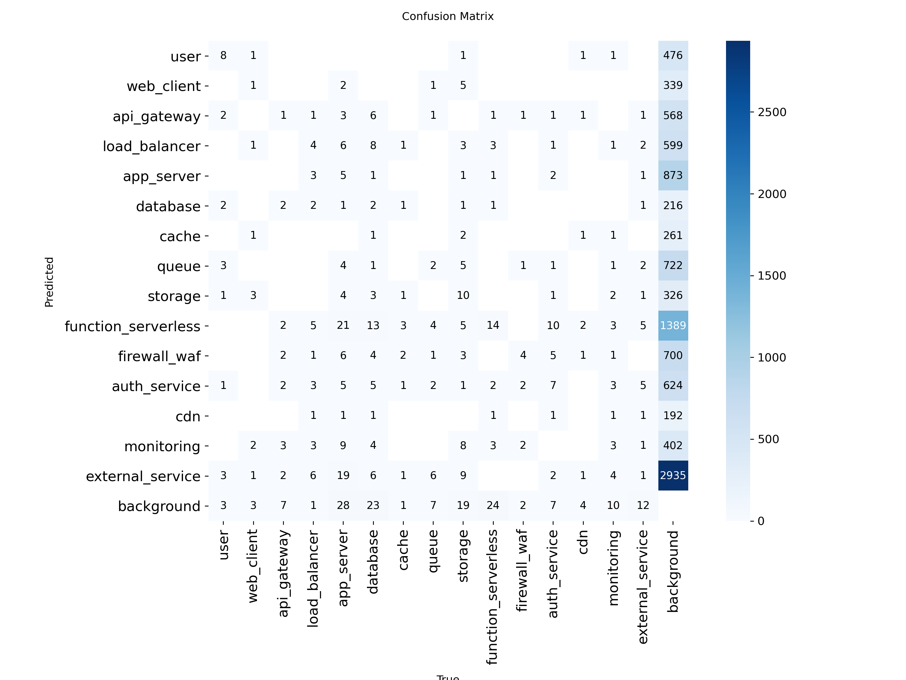

# Registro de treinamentos

| Data | Dataset (train/val/test) | Modelo | Épocas | imgsz | mAP50 (test) | Observações |
|------|--------------------------|--------|--------|-------|--------------|-------------|
| 2026-07-08 | 896 / 164 / 164 | YOLO11s (COCO pré-treinado, fine-tuned) | 96 (early stopping, patience=20; melhor peso salvo na época 76) | 1024 | 0.9950 | Treinado no Google Colab (GPU Tesla T4, ~1h13min). Batch solicitado de 32 caiu automaticamente para 16 por falta de memória da GPU (CUDA OOM) logo na 1ª época. Val/test ainda eram uma fatia do próprio dataset sintético (`dataset/external` vazio) — mAP50 próximo de 1.0 é otimista, não reflete generalização para diagramas reais. |
| 2026-07-21 | 800 / 50 / 50 (val/test agora 100% diagramas reais anotados manualmente via Roboflow) | YOLO11s (COCO pré-treinado, fine-tuned) | 33 (early stopping, patience=20; melhor peso salvo na época 13) | 1024 | 0.0693 | Primeira execução com métricas honestas de generalização (train continua 100% sintético; val/test passaram a usar diagramas reais). Queda esperada frente à execução anterior — evidencia gap de domínio sim-to-real: o modelo nunca viu um diagrama real durante o treino, só na avaliação. Desempenho bem desigual por classe: `user` (mAP50 0.437) e `database` (0.136) generalizam razoavelmente, `cache` e `cdn` ficam perto de zero (também as classes com menos instâncias reais, 10-11). Corrigidos antes deste treino: (1) `dataset/external/mapping.yaml` ausente — o projeto Roboflow tinha 17 classes em ordem alfabética, diferente das 15 classes/ordem canônica, corrompendo os rótulos reais; (2) `dataset/build_dataset.py` não limpava `dataset/final/` entre execuções, acumulando dados de execuções antigas. Próximo passo sugerido: anotar mais diagramas reais com `cache`/`cdn`/`firewall_waf`, e considerar incluir uma fração de imagens reais também no treino (hoje 100% sintético). |

## Por classe (execução 2026-07-08, val/test sintéticos — otimista)

| Classe | Imagens | Instâncias | P | R | mAP50 | mAP50-95 |
|---|---|---|---|---|---|---|
| all | 164 | 1060 | 0.999 | 0.999 | 0.995 | 0.994 |
| user | 56 | 67 | 0.999 | 1.000 | 0.995 | 0.994 |
| web_client | 62 | 85 | 1.000 | 0.990 | 0.995 | 0.995 |
| api_gateway | 66 | 82 | 1.000 | 1.000 | 0.995 | 0.995 |
| load_balancer | 64 | 75 | 1.000 | 1.000 | 0.995 | 0.995 |
| app_server | 60 | 72 | 0.999 | 1.000 | 0.995 | 0.993 |
| database | 50 | 61 | 1.000 | 1.000 | 0.995 | 0.995 |
| cache | 59 | 72 | 1.000 | 1.000 | 0.995 | 0.995 |
| queue | 58 | 70 | 0.999 | 1.000 | 0.995 | 0.995 |
| storage | 59 | 75 | 1.000 | 1.000 | 0.995 | 0.995 |
| function_serverless | 58 | 71 | 0.999 | 1.000 | 0.995 | 0.995 |
| firewall_waf | 55 | 65 | 0.999 | 1.000 | 0.995 | 0.995 |
| auth_service | 55 | 68 | 0.999 | 1.000 | 0.995 | 0.995 |
| cdn | 55 | 71 | 1.000 | 1.000 | 0.995 | 0.995 |
| monitoring | 52 | 60 | 0.999 | 1.000 | 0.995 | 0.995 |
| external_service | 56 | 66 | 0.998 | 1.000 | 0.995 | 0.988 |

## Por classe (execução 2026-07-21, val/test diagramas reais — medição honesta)

| Classe | Imagens | Instâncias | P | R | mAP50 | mAP50-95 |
|---|---|---|---|---|---|---|
| all | 50 | 562 | 0.116 | 0.169 | 0.0693 | 0.0294 |
| user | 16 | 23 | 0.330 | 0.514 | 0.437 | 0.150 |
| web_client | 10 | 13 | 0.143 | 0.231 | 0.0624 | 0.0368 |
| api_gateway | 18 | 21 | 0.0617 | 0.143 | 0.0221 | 0.0118 |
| load_balancer | 17 | 30 | 0.0713 | 0.367 | 0.0555 | 0.0215 |
| app_server | 38 | 114 | 0.105 | 0.0702 | 0.0204 | 0.00939 |
| database | 34 | 78 | 0.498 | 0.128 | 0.136 | 0.0698 |
| cache | 10 | 11 | 0 | 0 | 0.000646 | 0.000323 |
| queue | 16 | 24 | 0.0357 | 0.0833 | 0.0139 | 0.00711 |
| storage | 36 | 73 | 0.198 | 0.164 | 0.0896 | 0.0440 |
| function_serverless | 19 | 50 | 0.0486 | 0.160 | 0.0220 | 0.00531 |
| firewall_waf | 9 | 12 | 0.103 | 0.250 | 0.0701 | 0.0286 |
| auth_service | 19 | 38 | 0.0642 | 0.211 | 0.0459 | 0.0144 |
| cdn | 11 | 11 | 0 | 0 | 0.00955 | 0.00679 |
| monitoring | 16 | 31 | 0.0666 | 0.129 | 0.0245 | 0.0156 |
| external_service | 13 | 33 | 0.013 | 0.0909 | 0.0300 | 0.0201 |

## Matriz de confusão (execução 2026-07-21, split de teste)

